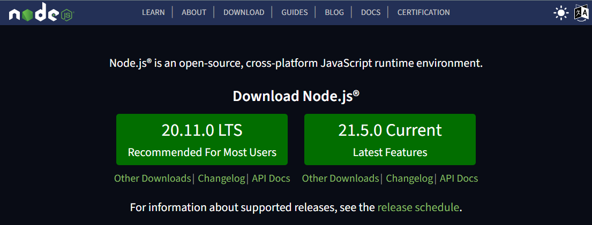
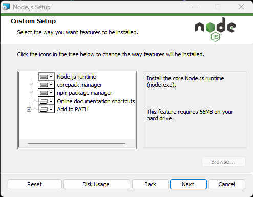

# node.js-start


## Quick Start
This repository provides a brief introduction to Node.js, covering everything from installation to creating a simple server using Express to serve HTML pages.

## About Node.js
Node.js is an open-source, cross-platform JavaScript runtime environment that enables developers to build server-side and network applications using JavaScript—similar to the Java Runtime Environment (JRE) for Java. 

With Node.js, you can run JavaScript code outside of a web browser, allowing for more versatile application development.

### Key Features of Node.js:
- **Server-Side JavaScript**: Execute JavaScript on the server, providing a powerful alternative to traditional server-side languages.
- **Non-Browser Environment**: The runtime omits browser-specific APIs, focusing instead on OS-level capabilities such as HTTP and file system libraries.
- **Database Communication**: Easily communicate with databases and interact with various files, streamlining back-end development.

### Benefits of Using Node.js:
- **Asynchronous and Event-Driven**: Node.js uses an event-driven architecture, which makes it efficient for handling multiple connections simultaneously.
- **NPM (Node Package Manager)**: Access to a vast repository of libraries and tools to enhance development productivity.

#### Asynchronous and Event-Driven
**Asynchronous:** In Node.js, operations like reading files or querying a database don't block the execution of your code. This means that while one operation is waiting (for example, waiting for a file to be read), Node.js can continue executing other code. This is particularly useful for web servers that need to handle many requests at once without waiting for each one to complete before moving on.

**Event-Driven:** Node.js relies on events to handle operations. When an asynchronous operation completes (like a file read or a database query), it emits an event. Node.js listens for these events and executes a callback function when they occur. This allows developers to write code that can react to events as they happen, improving responsiveness

# Node.js History
- **2009**: Node.js was created by Ryan Dahl, introducing a new way to build scalable network applications using JavaScript.
- **January 2010**: The Node Package Manager (npm) was introduced, simplifying the process of publishing and sharing code. It also streamlines the installation, updating, and uninstallation of packages, making it easier for developers to manage dependencies.
- **July 2011**: The first build of Node.js supporting Windows was released, expanding its usability across different operating systems.
- **February 2015**: The announcement to form a neutral Node.js Foundation was made. This foundation includes major companies like GoDaddy, IBM, LinkedIn, Microsoft, Netflix, PayPal, Walmart, Yahoo!, and Amazon Web Services, highlighting the widespread adoption and support for Node.js in the industry.

# Node.js Package Manager (npm)
npm, short for Node Package Manager, is bundled with Node.js and is accessible via the command line using the command "npm". It serves as a powerful package manager that allows developers to easily download, manage, and share code packages.

When you install a package using npm, it downloads the necessary files and places them in a directory called "node_modules". This folder is where all your project dependencies reside.

To use a downloaded package in your Node.js application, you can import it using the "require" function like this:
```javascript
const libraryModule = require("library-name");
```
This line of code allows you to access the functionalities provided by the package you installed, making it easy to integrate third-party libraries into your projects.

For more in-depth information about Node.js, you can refer to the Mozilla Developer Network (MDN) [Node.JS Definition](https://developer.mozilla.org/en-US/docs/Glossary/Node.js).

To learn more about npm and its features, visit the official [npm Documentation](https://docs.npmjs.com/).

# Node.js Processing
1. **User Request**: When a user visits a website by entering an HTTP URL in their browser, the browser initiates a request to that URL.
2. **Server Connection**: This URL points to a host server that runs Node.js, which is responsible for handling the incoming requests.
3. **Handling the Request**: Upon receiving the HTTP request, Node.js processes it using its event-driven architecture, allowing it to manage multiple requests efficiently.
4. **Reading Files**: Node.js then reads the necessary HTML file(s) from the server's file system. This can include not just HTML files, but also stylesheets, scripts, and other resources needed for the webpage.
5. **Sending Response**: After retrieving the HTML file, Node.js constructs an HTTP response that includes the requested HTML content and sends it back to the user's browser.
6. **Rendering the Page**: The client's browser receives the HTTP response and renders the HTML file, allowing the user to view the content of the website.

This process illustrates how Node.js acts as a bridge between the client and the server, efficiently managing requests and responses to deliver web content.

# Installing Node.js
There are two primary ways to install Node.js:

## First Way: Official Website
You can download Node.js directly from the official website: [Node.js Official Site](https://nodejs.org/en/). This method will install the complete Node.js package on your system. Note that whenever a new version is released, you will need to download and install the updated version manually.

When you visit the Node.js website, you will see two buttons for downloading:
- **Current**: This option provides the latest version of Node.js, which includes all the newest features and updates.
- **LTS (Long Term Support)**: This version is recommended for most users, as it is stable and has been tested extensively. It receives regular updates for security and performance, making it a safe choice for production environments.



To install Node.js, click on the appropriate button based on your needs. After the download is complete, follow the installation process, keeping the default options and settings selected unless you have specific requirements.



This installation method is straightforward, and by following the prompts, you'll have Node.js up and running in no time!

## Second Way: Using nvm (Node Version Manager)

Another method for installing Node.js is by using **nvm**, which stands for **Node Version Manager**. This tool is designed to help you install, manage, and update different versions of Node.js on your system. With nvm, you can easily switch between Node.js versions for different applications, making it a flexible choice for developers who work on multiple projects.

### Installation Steps for nvm
To install nvm, you will need to download the appropriate version based on your operating system:

- **For Mac/Linux**: You can find the installation instructions on the [NVM GitHub repository for Mac/Linux](https://github.com/nvm-sh/nvm).
- **For Windows**: Use the [NVM GitHub repository for Windows](https://github.com/coreybutler/nvm-windows) to download and install the version suitable for your system.

### Using nvm
Once nvm is installed, you can easily install and manage Node.js versions with the following commands:

- **Install a Specific Node.js Version**:
    ```bash
    nvm install x.x.x
    ```
    Replace `x.x.x` with the desired version number. This command downloads and installs the specified version of Node.js.

- **Activate a Specific Version**:
    ```bash
    nvm use x.x.x
    ```
    This command allows you to switch to the version of Node.js you want to use for your current terminal session.

Using nvm provides a powerful way to manage Node.js versions seamlessly, allowing you to keep your development environment organized and efficient.

# Node.js, npm, and npx
After installing Node.js and npm on your machine, you can verify their installations and check their versions with the following commands:

1. **Check Node.js Version**:
   You can check the version of Node.js installed on your system by running:
    ```
    node -v
    ```

    OR:
    ```
    node --version
    ```

2. **Check npm Version:**
    npm (Node Package Manager) is used to install and manage packages. To check the version of npm installed, use:
    ```
    npm -v
    ```

    OR:

    ```
    npm --version
    ```

   This command will display the installed version of npm, ensuring you have the package manager ready for use.

 3. **Check npx Version:**
  npx is a tool that comes with npm and is used to execute various scripts and command-line tools directly without needing to install them globally. To check the version of npx, run:   

    ```
    npx -v
    ```

    OR:

    ```
    npx --version
    ```
This will confirm that npx is available on your system and provide its version.

These commands are essential for ensuring your Node.js development environment is set up correctly, and they help you manage your packages effectively

# Running Node.js Environment
For quick learning and simple practice, you can use **REPL** (Read-Eval-Print Loop), which is also known as an interactive top-level or language shell.

### What is REPL?
REPL is a straightforward interactive programming environment that allows you to input single commands, execute them, and receive immediate results. In a REPL environment, code is executed piece by piece, making it an excellent tool for experimentation.

Here's how REPL works:
- **Read**: It reads the user's input, parses it into a JavaScript data structure, and stores it in memory.
- **Eval**: It evaluates the parsed data structure.
- **Print**: It prints the result of the evaluation back to the user.
- **Loop**: It repeats the above steps until the user presses Ctrl-C twice or Ctrl-D to exit.

You can [run REPL (the platform to write JavaScript and Node.js code in the command line)](https://nodejs.org/en/learn/command-line/how-to-use-the-nodejs-repl) by following these steps:

1. Open your command-line interface (CLI), such as CMD, Terminal, PowerShell, Git Bash, or any other terminal emulator.
2. Type "node" and press Enter.
3. You will enter the Node.js REPL environment, where you can start writing and executing your JavaScript code.
4. To exit the Node.js REPL, press Ctrl-C twice or Ctrl-D.

### Building Full Applications
For developing full applications, you will want to use your preferred code editor. Visual Studio Code (VS Code) is a popular choice among developers for its rich features and ease of use.

# Running .js files with Node.js
You can use Node.js to run your .js files directly, eliminating the need for an HTML file to call them. This allows for a streamlined development process. Here's how to do it:

1. **Navigate to Your Project Folder**: Use your file explorer to locate the folder containing your .js files (your JS project).
  
2. **Open Your Command-Line Interface**: Launch your CLI of choice (CMD, Terminal, PowerShell, Git Bash, or any other terminal emulator) within the current folder where your .js files are located.

3. **Create an Entry Point**: You can create a .js file, commonly named `index.js`, which will serve as the entry point for your Node.js application. This is typically where the main logic of your application resides.

4. **Run Your JavaScript File**: Type the following command, replacing `index.js` with the name of your file if it differs:
    ```
    node index.js
    ```
5. **View the Output**: After running the command, you will see the output of your file in the terminal, displaying any results or console logs generated by your code.
This method allows you to develop and test your JavaScript applications quickly and efficiently

# Node.js Globals
In JavaScript, the **global object** varies between environments:

- **In the Browser**: The global object is referred to as "window". You can access various properties and methods through it. For example:
  ```javascript
  window.alert("testing");
  window.console.log("testing");
  ```
- **In Node.js**: The global object is called "global". You can access global properties and methods using it. For example:
  ```javascript
  global.console.log("testing");
  ```

### Important Notes:
While window is specific to browser environments, global is used in Node.js for server-side applications. However, it's common to directly use console without the global prefix in Node.js, as console is a built-in global object available by default.

For more detailed information about global objects and other features in Node.js, refer to the [Node.JS API documentation](https://nodejs.org/api/).

# Working with Modules: ECMAScript modules & CommonJS modules
Node.js supports two primary module systems: **CommonJS modules** and **ECMAScript modules**. Understanding these systems is crucial for effectively structuring and organizing your JavaScript code.

## CommonJS Modules:
CommonJS modules were the original way to package JavaScript code for use in Node.js. This system allows developers to create reusable code by defining modules and managing dependencies. CommonJS uses the `require` function to import modules and `module.exports` to export them. 

Heres a brief overview:
- **Importing a Module**:
  ```javascript
  const myModule = require("./myModule");
  ```

 - **Exporting a Module**:
    ```javascript
    module.exports = {
      myFunction: function() {
        // function logic
      }
    };
    ```

For more detailed information on CommonJS modules, you can refer to the [Node.js CommonJS Modules documentation](https://nodejs.org/api/modules.html#modules-commonjs-modules).

### Example: Using Two Files "main.js" and "helper.js"
In this example, we will demonstrate how to use CommonJS modules by exporting functions from one file and importing them in another.

#### File Structure
Consider you have two JavaScript files in the same directory:
- **main.js**: This is the main file that runs your application.
- **helper.js**: This file contains utility functions that assist in your application's tasks.

#### Step 1: Create the Helper Module
In "helper.js", we will define and export some functions. For example:

```javascript
// helper.js
function fun1() {
    console.log("Function 1 executed!");
}

function fun2() {
    console.log("Function 2 executed!");
}

// Exporting the functions so they can be used in other files
module.exports = {
    fun1,
    fun2
};
```
In this file, we define two functions, fun1 and fun2, and export them using module.exports. This allows other files to access these functions.

#### Step 2: Importing the Helper Module
In "main.js", we will import the functions from "helper.js" and use them:
```javascript
  // main.js
  const tools = require('./helper.js');

  // Calling the functions from helper.js
  tools.fun1(); // Prints: Function 1 executed!
  tools.fun2(); // Prints: Function 2 executed!
```
In "main.js", we use the require function to import the contents of "helper.js". The variable tools now holds an object that provides access to the exported functions from "helper.js". We can then call tools.fun1() and tools.fun2() to execute these functions.

In Node.js, the require() function is a built-in method used to include external modules that exist in separate files. By using require('./helper.js'), we gain access to all the functions available in "helper.js".

The variable "tools" now becomes an object that provides access to these functions. For example, if "helper.js" has the functions fun1 and fun2, we can access and execute them like this:
```javascript
  tools.fun1(); // Calls fun1
  tools.fun2(); // Calls fun2
```

## ECMAScript Modules:
ECMAScript modules, also known as ES modules, are the official standard for packaging JavaScript code for reuse. They are widely used in modern JavaScript development, including in browsers. ES modules use the "import" and "export" statements for module management, which makes them more intuitive and easier to work with. import() & export() statements are used to refer to an ES module. 

Here's how they function:
- **Importing a Module**:
  ```javascript
  import { myFunction } from "./myModule.js";
  ```

 - **Exporting a Module**:
    ```javascript
    export function myFunction() {
      // function logic
    }
    ```

Using ES modules also offers benefits such as improved static analysis, better performance in certain cases, and support for asynchronous loading of modules. For more information, you can check the [Node.js ECMAScript Modules documentation](https://nodejs.org/api/esm.html#modules-ecmascript-modules).

### Example: Using Two Files "addTwo.mjs" and "app.mjs"
In this example, we will demonstrate how to use ECMAScript modules by exporting a function from one file and importing it in another.

#### First File: "addTwo.mjs"
This is a module file named "addTwo" with the extension ".mjs". It contains the following function:

  ```javascript
  // addTwo.mjs
  function addTwo(num) {
      return num + 2;
  }

  // Exporting the function so it can be used when this module is imported
  export { addTwo };
  ```
In this file, we define a function called addTwo that takes a number as an argument and returns that number plus two. The export statement allows this function to be imported into other modules.

#### Second File: "app.mjs"
This is another module file named "app" with the extension ".mjs". It imports the function from "addTwo.mjs":
  ```javascript
  // app.mjs
  import { addTwo } from './addTwo.mjs';

  // Prints: 6
  console.log(addTwo(4));
  ```
In "app.mjs", we import the addTwo function from "addTwo.mjs" using the import statement. When we call addTwo(4), it adds two to the number four, resulting in six, which is then printed to the console.

### Understanding .mjs and .js Extensions
In JavaScript, the file extension we use can indicate how the module system should interpret the file. Here's a breakdown of when to use .mjs and when .js is appropriate:

#### When to Use .mjs
- **.mjs** is specifically used for ECMAScript modules. This extension signals to the JavaScript engine that the file should be treated as an ES module, which allows you to use "import" and "export" statements.
- You should use .mjs when:
  - You want to ensure compatibility with environments that require explicit module definitions, such as older versions of Node.js or certain build tools.
  - You are working in a mixed environment where some files are CommonJS modules and others are ES modules, making it clear which is which.

#### When to Use .js
- **.js** files can be treated as CommonJS modules by default in Node.js, but they can also be configured to work as ES modules if your environment supports it (like in Node.js version 12 and above with "type": "module" in your package.json).
- You should use .js when:
  - You are working with CommonJS modules and do not need the module features of ES.
  - You have configured your Node.js environment to treat .js files as ES modules by specifying the module type in your package.json.

### Example Scenarios
1. **Using .mjs**: If you have a project that uses ES modules and you want to avoid any ambiguity, you can name your files with the .mjs extension. This is especially useful when collaborating with teams that might be using different module systems.
  
2. **Using .js**: If you are developing a Node.js application that primarily uses CommonJS or if you have a simple script, using .js is sufficient and is the more conventional choice.

### Summary:
- Use **.mjs** for explicit ES module files to take advantage of the modern module system.
- Use **.js** for traditional scripts or when you are confident in your module configuration.

### Key Takeaways:
- **Using .js with ES Modules:** If your package.json specifies "type": "module", all .js files are considered ES modules. This allows you to write modern module syntax throughout your project.
- **Flexibility:** This setup provides flexibility in your codebase, enabling you to mix and match module types if needed (e.g., using CommonJS in some files and ES modules in others).

By understanding the distinction between these extensions, you can better organize your code and ensure that your modules function as intended.

#### Additional Resources
For more information on the differences between ".mjs" and ".js" file extensions, you can refer to the MDN documentation on ".mjs versus .js".

## CommonJS modules:
Are the original way to package JavaScript code for Node.js. 
In Node.js module system, each file is treated as a separate module. For example, consider a file named foo.js:

## Modules: CommonJS modules:
> JavaScript module is a file that contains a few lines of code written in JavaScript
> Modules are the same as JavaScript Libraries and they are often contains class or list of functions (tools)
> We can use these modules to reduce the number of line of code in one script file. 
So we can also create our custom modules by writing our functions in a separate file then reference it
> Instead of writing the full function(s) body, we can just reference the function name

Like working with packages in Python

### require() and import()
One of the major differences between require() and import() is as follows:
- **Location of Call:** require() can be called from anywhere within the program, allowing for flexibility in loading modules. In contrast, import() must be declared at the beginning of the file and cannot be used conditionally; it always executes at the top level.

- **File Extensions:** To use the require() statement, a module must be saved with a .js extension. In contrast, when using the import() statement, the module is typically saved with a .mjs extension, especially in environments that differentiate between module types.

- **Support and Standards:** ES modules (using import()) are the standard for JavaScript and are fully supported by all modern browsers, having been introduced in ES6 (2015). They are also supported by the current versions of Node.js. Conversely, CommonJS (using require()) is the default module system for server-side applications in Node.js and is supported by all Node.js versions since version 14.

You can visit the [MDN JavaScript Module](https://developer.mozilla.org/en-US/docs/Web/JavaScript/Guide/Modules) to learn more about this concept

This is a glimpse about things that will be covered in details later!

# Start Learning
To go through the learning process step by step, you will need to read the files in the following sequence of the folders to understand the key points of working with Node.js:
- 1.basic 
  - index1.js
  - index2.js
- 2.events
  - index1.js
- 3.files
  - index1.js
  - index2.js
  - index3.js
- 4.node_pages
  - index1.js
  - index2.js
- 5.modules
  - my-module1.js
  - index1.js
  - my-module2.js
  - index2.js
- 6.packages
  - index1
  - index2
  
### NOTES:
- To practice the final two files of "6.packages", you need to install the express JS framework, and the steps are written in the comment inside the files
- the folder "node-modules" have been excluded from the repo as its just contains files for the package "express" that you can install

# References, Resources, and Credits:
- https://nodejs.dev/en/learn/
- https://www.pluralsight.com/blog/
- https://en.wikibooks.org/wiki/Main_Page
- https://nodejs.dev/learn
- https://nodejs.org/en/
- https://github.com/nodejs/examples 
- https://developer.mozilla.org/en-US/docs/Glossary
- https://stackoverflow.com/questions/
- https://www.javascripttutorial.net/
- https://www.freecodecamp.org/news/
- https://reflectoring.io/
- https://www.w3schools.com/nodejs/default.asp 
- [Tech Talk Youtube channel](https://www.youtube.com/channel/UCI-fqZ8uEEFLzzEF3vwKDLA)